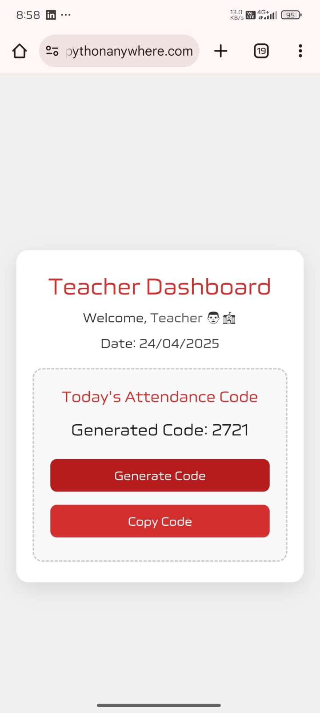

# 🧠✨ Student Attendance Portal — Reimagining Campus Attendance 🚀

> A cutting-edge, AI-ready attendance system that transforms educational institutions with real-time automation, analytics, and geo-intelligence.


---

## 🚀 The Future of Attendance is Now

Say goodbye to manual errors, proxies, and outdated methods.

The **Student Attendance Portal** is a next-generation system designed to revolutionize how academic institutions handle student attendance. It offers:

- 🌍 **Real-time geo-location validation**
- 📊 **Auto-generated analytics and reports**
- 💻 **Clean, responsive, and intuitive UI/UX**
- 🧠 **Scalable architecture ready for AI/ML integration**

---

## 🧩 Core Features

| 🔧 Feature              | ⚡ Description |
|------------------------|---------------|
| 🔐 Secure Auth          | Role-based login with encrypted user credentials |
| 📍 Location Validation  | Teachers must be physically present to mark attendance |
| 📈 Analytics Dashboard  | View attendance insights, predictions & heatmaps |
| 📤 Export Reports       | Download attendance in PDF/Excel in one click |
| 👨‍🏫 Dual Interfaces     | Student & teacher dashboards with personalized views |
| 📱 Fully Responsive     | Works seamlessly on all devices (mobile, tablet, desktop) |
| 🧠 AI-Ready             | Code structure supports ML-based analytics modules |

---

## 👥 User Experience Flow

### 🎓 For Students:
- 🔐 Secure login & personalized dashboard
- 📊 View individual attendance records and trends
- 🧾 Download personal reports and summaries

### 🧑‍🏫 For Teachers:
- 🔐 Login with real-time geo-location verification
- 📍 Mark attendance only when physically present on campus
- 📈 View & export class-wise attendance reports
- 🧮 Analyze attendance patterns across sessions

---

## 🧬 Tech Stack Snapshot

| Layer        | Technologies Used                          |
|--------------|---------------------------------------------|
| 💻 Frontend   | HTML, CSS, JavaScript                      |
| 🧠 Backend    | Python (Flask or Django based architecture) |
| 📍 Geo-Validation | HTML5 Geolocation API + Backend Check    |
| 🔒 Security   | Session handling, role-based access, input validation |
| 📊 Reports    | CSV / Excel / PDF generation using Python libraries |
| 📱 UI Design  | Responsive web design with custom CSS       |

---

## 📸 Visual Showcase

> 📁 Add your screenshots in the `/screenshots` folder to display them below:

```md



