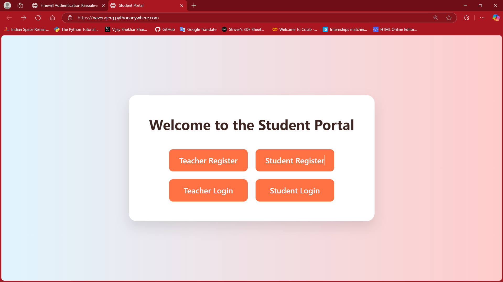

# 🧠✨ Student Attendance Portal — Reimagining Campus Attendance 🚀

> A smart, secure, and futuristic attendance management system built to empower educational institutions with automation, analytics, and location intelligence.


---

## 🚀 The Future of Attendance is Now

Say goodbye to manual registers and outdated excel sheets. The **Student Attendance Portal** introduces a **next-gen** attendance system that combines:
- 🌍 **Geo-location validation**
- 📊 **Auto-generated smart reports**
- 💡 **Clean, interactive UI/UX**
- 🧠 **AI-ready architecture**

It’s not just an app — it’s a **movement towards smarter education**.

---

## 🧩 Core Capabilities

| 🛠️ Feature | ⚡ Description |
|-----------|----------------|
| 🔐 Secure Auth | Role-based login with encrypted credentials |
| 🌍 Smart Location | Teachers must be physically present to mark attendance |
| 📈 Insightful Dashboards | Attendance insights, heatmaps, and predictions |
| 📤 Export Engine | Download reports in PDF/Excel in 1 click |
| 🧑‍💻 Dual Role Interface | Personalized experience for both teachers & students |
| 📱 100% Responsive | Works beautifully on desktop, tablet, and mobile |
| 🧠 AI-Ready | Clean architecture for future ML integration |

---

## 👥 User Experience Flow

### 🎓 Students:
- ✅ **Login & profile access**
- 📊 **View personal attendance records**
- ⏳ **Monitor daily/monthly stats**

### 🧑‍🏫 Teachers:
- ✅ **Secure login with real-time location validation**
- 📍 **Mark attendance for live sessions only if on campus**
- 📈 **Export reports and analyze class attendance patterns**

---

## 🖼️ Visual Previews

> 📸 Add real screenshots to the `/screenshots` folder for live demo previews

```md



## 🧬 Tech Stack Snapshot

